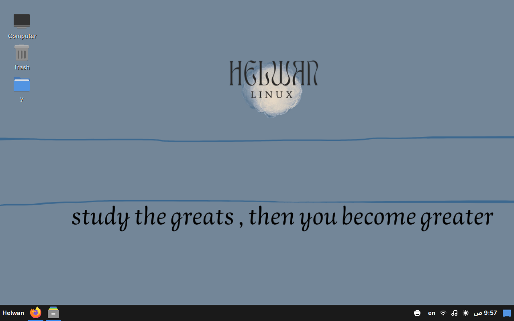

# Helwan Linux Developer Edition (LTS)

<p align="center">
  
  <br>Helwan Linux Developer Edition - Long Term Support
</p>

<p align="center">
  Arch-Linux based distro built with the <b>LTS Kernel</b> for maximum stability. 
  <code>Handcrafted for programmers, YouTubers, and production environments.</code>
</p>

## Helwan Linux ☕❤️

[☕ Buy Me a Coffee](https://buymeacoffee.com/helwanlinux)  
[❤️ Support on Ko-fi](https://ko-fi.com/helwanlinux)

---

## Table of Contents

- [Welcome to Helwan Linux](#welcome-to-helwan-linux)
- [What is Helwan Linux](#what-is-helwan-linux)
- [What's inside](#whats-inside)
  - [Code Editors & Dev Tools](#code-editors--dev-tools)
  - [Programming Languages & Dev Environments](#programming-languages--dev-environments)
  - [Docker & DevOps Ready](#docker--devops-ready)
  - [Multimedia Creation](#multimedia-creation)
  - [Internet & Communication](#internet--communication)
  - [Office Suite](#office-suite)
  - [System Tools & Utilities](#system-tools--utilities)
- [Official Tools Included](#official-tools-included-in-helwan-linux)
- [System Requirements](#system-requirements)
- [Community & Resources](#helwan-linux-community--resources)
- [Official Resources](#official-resources)
- [Contact Us](#contact-us)
- [Useful Commands](#useful-commands-aliases)
- [License](#license)

---

## Welcome to Helwan Linux

Helwan Linux - Cinnamon Edition  
Built on top of Arch Linux using archiso and Calamares  
Designed by developers, for developers and creators



---

## What is Helwan Linux

Helwan Linux is not just another Linux distro.  
It’s a handcrafted Arch-based system built to empower programmers, YouTubers, and power users with a fast, secure, and full-featured desktop — right out of the box.  

With the Cinnamon desktop, the elegance of simplicity meets the power of performance.

---

## What's inside

Everything a creative or a coder needs — already preinstalled and ready to go.

### Code Editors & Dev Tools

- **Geany** – Fast & simple IDE for any language  
- **VS Code (code)** – Industry-standard code editor  
- **Meld** – Visual diff and merge tool  
- **Python-PyQt5** – Build stunning GUIs in Python  
- **QtCreator + qt5-tools** – C++ GUI development made easy  
- **DBeaver** – A universal SQL client & DB management platform

### Programming Languages & Dev Environments

- **Git** – Version control system  
- **Perl** – Practical text-processing language  
- **Python** – Versatile scripting & AI  
- **OpenJDK (jdk)** – Java development environment  
- **PHP** – Web scripting  
- **Node.js** – JavaScript runtime  
- **Go** – Fast systems/network programming  
- **Rust** – Memory-safe performance  
- **Lua** – Lightweight embedded scripting  
- **SQLite** – Embedded SQL engine  
- **MariaDB** – High-performance relational DB

### Docker & DevOps Ready

- **Docker** – Build and run containers  
- **Docker-Compose** – Manage multi-container apps  
- **Lazydocker** – Terminal UI for managing Docker

### Multimedia Creation

- **mpv && SMPlayer** – All-format video/audio player  
- **Audacious** – Lightweight music player  
- **Vokoscreen** – Screen recorder for tutorials

### Internet & Communication

- **Firefox** – Secure, fast web browser  
- **helsync** – Sync your phone with your PC   
- **Geary** – Lightweight email client

### Office Suite

- **abiword**
- **gnumeric**

### System Tools & Utilities

- **Timeshift** – System restore like Time Machine  
- **GParted** – Partition management made easy  
- **UFW + helUFW** – Firewall management CLI + GUI  
- **MTools** – Access MS-DOS disks  
- **HTop** – Interactive system monitor  
- **YAY** – AUR helper for installing community packages  
- **helstore** – GUI package manager

---

## Official Tools Included in Helwan Linux

<details>
<summary>The Core</summary>

| Tool        | Description                                                        |
|------------|--------------------------------------------------------------------|
| hpm        | Human-friendly package manager with natural-language command chaining. |
| momo       | Smart TUI diagnostics tool for system performance and issue detection. |
| welcome    | User-friendly utility for system maintenance and kernel management. |
| hel-ai-gate| Lightweight bridge for integrated AI assistant features.           |
| helfetch   | Enhanced system information fetch tool with a modern UI.           |
| hel-sync   | Seamless PC-mobile connectivity and bi-directional file transfer.  |

</details>

<details>
<summary>System & Admin</summary>

| Tool            | Description                                                        |
|----------------|--------------------------------------------------------------------|
| helufw         | Graphical interface for simple and fast firewall configuration.    |
| hel-netfix     | GUI-based tool to diagnose and repair network connectivity issues. |
| hel-bootfix    | Specialized utility to recover and fix system boot partitions.     |
| hel-usb-writer | Tool to burn ISO images to USB drives safely.                      |
| hel-iso-signer | Security utility to sign and verify official ISO images.           |
| hel-sec-audit  | Quick security scanner to audit system vulnerabilities.            |

</details>

<details>
<summary>Developer Suite</summary>

| Tool            | Description                                                        |
|----------------|--------------------------------------------------------------------|
| hel-builder    | Professional tool to create, edit, and manage PKGBUILD files.      |
| hel-web-server | GUI-based local development server for web developers.             |
| hel-diagram    | Flowchart and diagram creation tool for software architecture.     |
| hel-process    | GUI task manager to monitor and control system processes.          |
| hel-terminal   | Customizable terminal emulator designed for the Helwan environment.|

</details>

<details>
<summary>Daily Essentials</summary>

| Tool            | Description                                                        |
|----------------|--------------------------------------------------------------------|
| hel-store      | Minimalist GUI app store for easy software management.             |
| hel-text-editor| Lightweight code and text editor with syntax highlighting.         |
| hel-markdown   | Focused editor for creating and viewing documentation files.       |
| hel-tutorial   | Interactive tutorials to master Linux commands and basics.         |

</details>

<details>
<summary>Helwan Games</summary>

| Tool            | Description                                                        |
|----------------|--------------------------------------------------------------------|
| hel-blocks     | Classic Tetris-style brick game for native entertainment.          |
| hel-space-fight| Lightweight space combat action game.                               |
| hel-solitaire  | The classic card game experience, natively built.                  |
| hel-cmd-runner | Fun interactive tool to test and run system commands.              |

</details>

---

## System Requirements

### Recommended
- 4GB+ RAM  
- Dual-core+ 64-bit CPU  
- 32GB+ storage  
- Any modern GPU

### Minimum
- 3GB RAM  
- Any 64-bit CPU  
- 16GB storage  
- Integrated GPU (or external)

---

## Helwan Linux Community & Resources

### Video Reviews
- [DGLFI épisode 58](https://peertube.pcservice46.fr/w/t4w7FgJXbX94CFoxRpDNcF)  
- [Helwan Linux: DistroTuber](https://www.youtube.com/watch?v=OMxUR3n11iw)  
- [How to Install Helwan Linux on VirtualBox](https://www.youtube.com/watch?v=Ps7J2omO-BU&t=1s)

### Articles & Media
- [distritotux](https://www.distritotux.cl/2025/08/helwan-linux-el-combo-perfecto-de-arch.html)  
- [ItsFOSS gitlab](https://itsfoss.gitlab.io/post/helwan-linux-a-made-in-egypt-linux-distribution/)  
- [Linux Today](https://www.linuxtoday.com/blog/helwan-o-s-egypts-all-purpose-linux-distribution/)  

---

## Official Resources

- [Website](https://helwan-linux.github.io/helwanlinux/index.html)  
- [Forum](https://helwanlinux.createaforum.com/index.php)  
- [Facebook Page](https://www.facebook.com/profile.php?id=61571106461288)

---

## Contact Us

✉️ E-mail: [helwanlinux@gmail.com](mailto:helwanlinux@gmail.com)

---

## Useful Commands (Aliases)

```bash
alias sync="sudo pacman -Syyy"            
alias install="sudo pacman -S"            
alias update="sudo pacman -Syu"          
alias search="sudo pacman -Ss"            
alias search-local="sudo pacman -Qs"     
alias pkg-info="sudo pacman -Qi"          
alias local-install="sudo pacman -U"      
alias helwan="uname -a"                   

---

## License

This project is licensed under the **GNU General Public License v3**. See the [LICENSE](LICENSE) file for more details.
